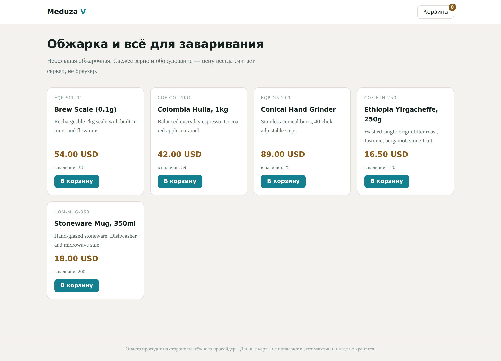
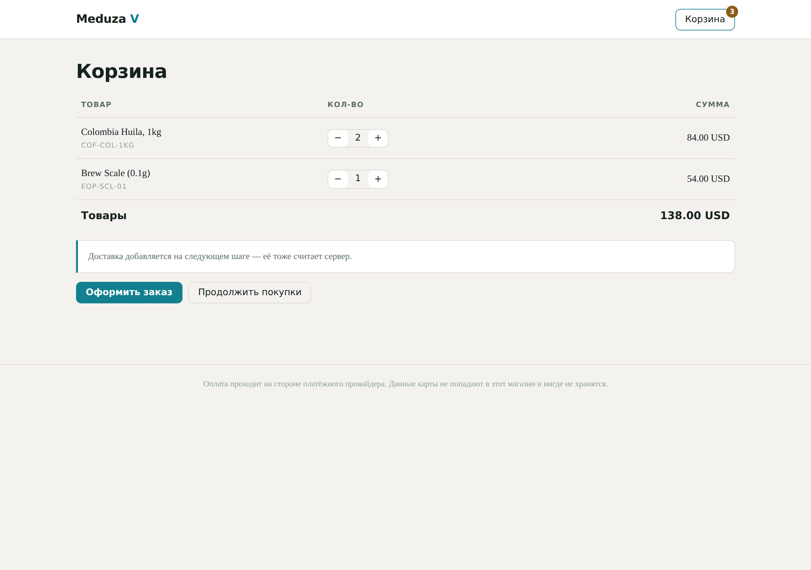
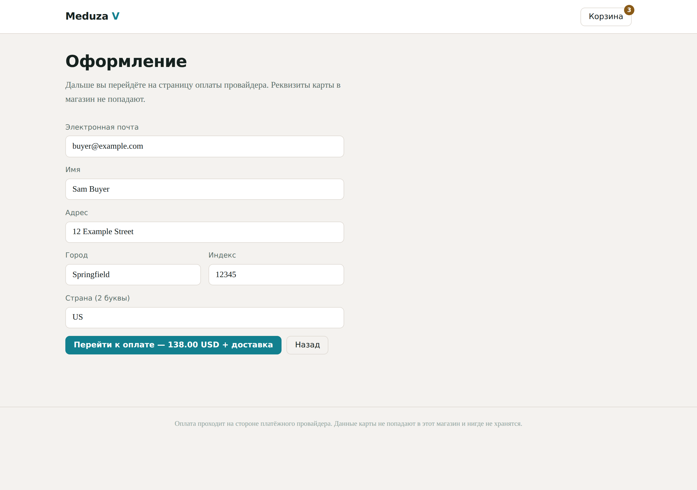
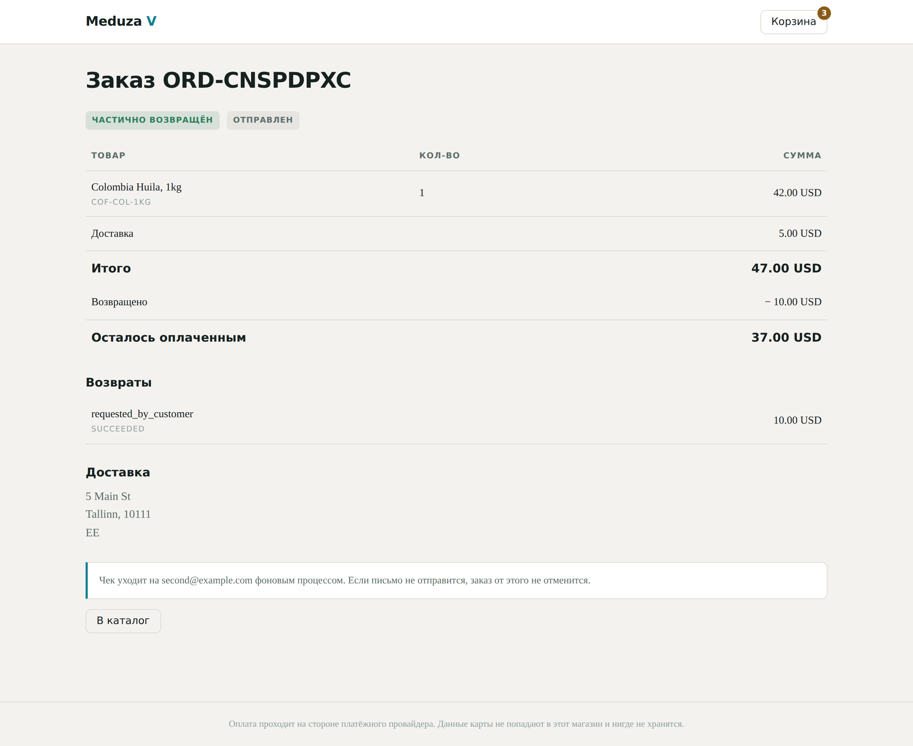
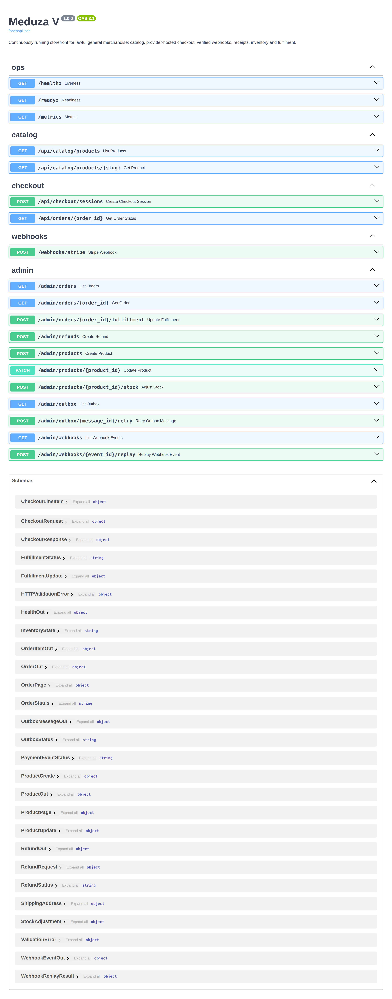

# Meduza V — что показывать и как это увидеть

Презентация магазина, который запускается на обычном ПК **без Docker**.
Все скриншоты ниже сняты с реально работающей установки, а не нарисованы:
установщик поднял SQLite-версию, через неё прошли два настоящих заказа,
подписанный вебхук, отгрузка и частичный возврат.

---

## 1. Демо за пять минут

**Linux / macOS:**

```bash
git clone <репозиторий> && cd meduza-v
./installer/install-local.sh
```

**Windows** — двойной клик по `installer\install-local.bat`, либо:

```powershell
.\installer\install-local.ps1
```

Скрипт сам: проверит Python 3.11+, создаст `.venv`, поставит зависимости,
сгенерирует `.env` с случайным админ-ключом, накатит миграции, зальёт
демо-каталог, запустит веб и фоновый воркер и откроет браузер.

Что печатает установщик в конце:

```
Meduza V is running.

  Storefront   http://127.0.0.1:8000
  API docs     http://127.0.0.1:8000/docs
  Admin key    <случайный ключ>

  Restart later:  ./start-local.sh
  Logs:           tail -f server.log worker.log
```

> **Демо-режим.** `PAYMENT_PROVIDER=fake`, `EMAIL_BACKEND=console`.
> Деньги не двигаются, чеки печатаются в `worker.log`. Для настоящего
> магазина — `installer/install.sh` (Docker + PostgreSQL) и ключи Stripe в `.env`.

---

## 2. Сценарий показа (7 шагов, ~4 минуты)

| # | Шаг | Что говорить |
|---|-----|--------------|
| 1 | Каталог | «Цены и остатки приходят с сервера, браузер их не считает» |
| 2 | Кладём товары в корзину | Остаток на карточке — живой |
| 3 | Корзина | Сумма товаров есть, доставки ещё нет — её посчитает сервер |
| 4 | Оформление | «Реквизиты карты в магазин не попадают» — уходим на страницу провайдера |
| 5 | Оплата (вебхук) | Показать в терминале, что повтор того же события даёт `duplicate` |
| 6 | Статус заказа | Оплачен, отправлен, частично возвращён — всё на одной странице |
| 7 | Чек в `worker.log` | Письмо ушло **после** транзакции, отдельным процессом |

---

## 3. Скриншоты

### Каталог



Пять товаров из демо-набора. Остатки — реальные: 38 и 59 вместо исходных
40 и 60, потому что два заказа уже прошли.

### Корзина



Количество меняется степпером, сумма пересчитывается. Подпись честно
предупреждает, что доставку добавит сервер на следующем шаге.

### Оформление



Форма собирает только почту и адрес. Кнопка ведёт на страницу оплаты
провайдера — карточных полей в магазине нет вообще.

### Статус заказа



Тот самый заказ после оплаты, отгрузки и возврата 10.00 USD:
`частично возвращён` + `отправлен`, итог 47.00, осталось оплаченным 37.00.
Страница открывается по ссылке с одноразовым токеном — без токена заказ не виден.

### Документация API



19 операций, сгенерированных из кода. Swagger UI лежит внутри проекта, поэтому
страница открывается и на машине без интернета.

---

## 4. Что показать в терминале

Это убеждает лучше любого слайда — три команды, три ответа.

**Повтор вебхука ничего не ломает** (доставка «хотя бы один раз»):

```
first : 200 {"status":"processed"}
replay: 200 {"status":"duplicate"}
```

**Подделанное тело отклоняется** (сумма изменена с 11300 на 99999):

```
tampered: 400 {"error":"invalid signature"}
```

**Админка закрыта:**

```
без ключа       -> 401
с чужим ключом  -> 401
с верным ключом -> 200
```

**Перевозврат отклоняется** — заказ на 47.00, уже возвращено 10.00,
просим ещё 100.00:

```
HTTP 422
```

**Чек ушёл фоновым процессом**, а не внутри транзакции оплаты:

```
app.notifications.console :: receipt_would_be_sent {'to': 'buyer@example.com',
  'subject': 'Meduza V: receipt for order ORD-S8F3HN7K', ...}
app.services.outbox :: receipt_delivered {'attempts': 1}
```

---

## 5. Три тезиса, ради которых всё это

1. **Считает сервер.** Цена, доставка, остаток — из базы. Из браузера
   приходят только SKU и количество.
2. **Платёж нельзя подделать и нельзя провести дважды.** Подпись проверяется
   настоящим кодом Stripe; повтор события ловится тремя слоями:
   уникальный индекс по `(provider, event_id)`, машина состояний заказа и
   `inventory_state`.
3. **Письмо не может отменить оплату.** Чек кладётся в outbox в той же
   транзакции, что и оплата, а отправляется отдельным воркером с повторами.

---

## 6. Честные ограничения — сказать вслух

* SQLite-режим **не для продакшена**: нет блокировок строк, поэтому защита
  от «двое купили последний товар одновременно» слабее, чем на PostgreSQL.
  Для настоящего магазина — `installer/install.sh`.
* Шрифты подгружаются с Google Fonts; без сети страница отрисуется
  системным шрифтом — на скриншотах выше именно так. Это единственное, что
  магазин просит из интернета: Swagger UI лежит локально, платежи в демо-режиме
  никуда не ходят.
* В демо-режиме платёж имитируется. Настоящие деньги — только после
  подстановки ключей Stripe и перехода на `PAYMENT_PROVIDER=stripe`.

---

## 7. Если нужен слайд-дек

Порядок слайдов, по одному экрану на слайд:

1. Титул: «Meduza V — магазин, который запускается одной командой»
2. Скриншот каталога + тезис «считает сервер»
3. Корзина и оформление рядом + «карта не попадает в магазин»
4. Статус заказа + «оплата, отгрузка, возврат — одна страница»
5. Терминал с `processed` / `duplicate` + «повтор не создаёт второй заказ»
6. Схема потока (см. README) + «письмо не блокирует оплату»
7. Ограничения из раздела 6 — не прятать, а проговорить
